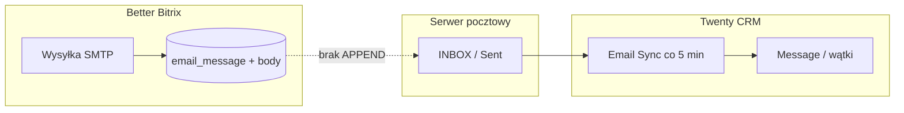

# Import historii BB przez IMAP APPEND

**Status:** zatwierdzone przez właściciela **2026-08-30** · start **warunkowany bramkami** (§8)  
**Kotwice:** Twenty v2.37.0 · Email Sync ~400 msg/min · EVENT_CONTRACT NR-5 · E12.5 NR-1

---

## 0. Executive summary (Mariusz — 2 min)

| | |
|---|---|
| **Problem** | BB wysyłał odpowiedzi przez SMTP i trzymał je w Supabase — **nie robił APPEND na IMAP**. Twenty widzi tylko skrzynkę → brak wątków na zsynchronizowanych leadach. |
| **Rozwiązanie** | Jednorazowo: BB `email_message` → RFC822 → **IMAP APPEND** do folderu **`BB Archive`** na skrzynce handlowca → Twenty Email Sync robi resztę. |
| **Zakres (C2)** | ~**166** otwartych kart legacy · ~**236** adresów klientów · ~**5 900** wątków · ~**7 400** wiadomości |
| **Czas inżynierii** | **4–5 dni roboczych** (preflight + narzędzie + dry-run + apply + QA) |
| **Czas maszynowy** | APPEND ~**20–30 min** · sync Twenty ~**20 min** (przy ~400 msg/min) |
| **Koszt cash** | ~**0 PLN** infra (istniejący IMAP + Twenty) · koszt = **czas Dawida** (~32–40 h) |
| **Cutover pn** | **Nie czeka** na import — BB = archiwum read-only; import = **faza 2** po go-live |
| **Start importu** | dopiero gdy: **(1)** preflight PASS **oraz** **(2)** min. **30 dni** po cutoverze + przegląd archiwum BB |

---

## 1. Dlaczego BB ma maile, których Twenty nie widzi



**Potwierdzenie w kodzie BB:**

- `app/api/inbox/adress/sentMail/route.ts` — po wysłaniu zapisuje `body`, `message_id`, `folder_path: Sent` do Supabase.
- `lib/getEmails.ts` — komentarz: *„Sent z zapisaną treścią nie wymaga IMAP”* — outbound żyje w DB, nie na serwerze.
- Twenty **nigdy** nie dostaje historii bezpośrednio z BB API — tylko przez **IMAP**.

Sync leadów (`sync_bb_to_twenty.py`) przeniósł **karty** (etap, owner, `bb:{id}`), **nie** wątki.

---

## 2. Zasada konstrukcyjna (nie negocjujemy)

1. **Oddajemy maile skrzynkom.** Twenty = wyłącznie natywny Email Sync.
2. **Zero zapisu** do `Message` / MCMA przez REST/GraphQL (NR-1) — sync jest właścicielem tabel (dedup, wątkowanie, visibility, message-cleaner).
3. **Folder docelowy:** tylko **`BB Archive`** — nie INBOX, nie Sent (NR-3).
4. **Rekordy bez body** w BB → **pomijamy**, lista w raporcie (NR-2 — bez placeholderów).
5. **Same-domain** (`@owocni.pl` ↔ `@owocni.pl`) → nie eksportujemy.
6. **Sortownia / platformy reklamowe** — import **nie emituje** eventów (nie dotyka Opportunity → diff Stape Store głuchy z konstrukcji).

---

## 3. Zakres liczbowy (stan 28.08.2026)

| Metryka | Wartość | Źródło |
|---|---:|---|
| Otwarte `BETTER_BITRIX_LEGACY` w Twenty | **~166** | `CUTOVER_MAIL_HISTORY_DECISION.md` |
| Unikalne emaile klientów (sync 30d) | **~236** | j.w. |
| Wątki BB powiązane z tymi adresami | **~5 900** | j.w. |
| Wiadomości w wątkach | **~7 400** | j.w. |
| Cała tabela `email_message` (kontekst) | **~330 000** | **poza zakresem** (NR-4 / C3 odrzucone) |

### Warianty (decyzja kosztowa)

| Wariant | Zakres | Wiadomości (szac.) | Kiedy |
|---|---|---:|---|
| **C2 — rekomendowany** | pełna historia ~236 adresów / ~166 kart | **~7 400** | po preflight PASS |
| **C1** | te same karty, maile od **2026-01-01** | **~2 500–3 500** (40–50% C2) | mniejszy QA, ten sam pipeline |
| **C-Δ (delta)** | tylko **wychodzące BB-only** (Sent + body, brak na IMAP) | **~1 500–2 500** (audit) | jeśli preflight (e) dedup OK dla inbound |
| **C3** | cała poczta BB | ~330k | **odrzucone** |

**Doprecyzowanie liczb:** `python3 integrations/tools/audit_bb_mail_import_scope.py` → JSON w `exports/bb_sync/`.

---

## 4. Koszt

### 4.1 Infrastruktura (PLN)

| Pozycja | Koszt | Uwagi |
|---|---:|---|
| Serwer IMAP (thecamels / istniejący) | **0** | APPEND na istniejące skrzynki |
| Twenty Email Sync (plan Pro) | **0** | już opłacone; ~400 msg/min |
| Supabase BB (odczyt) | **0** | read-only service key |
| Dodatkowe storage skrzynki | **~0–50 PLN/m** | +~7k msg × ~50 KB ≈ **350 MB** łącznie — marginalne |
| GCP (worker guard) | **0** | istniejący `twenty-crm-worker` |

### 4.2 Czas inżynierii

| Faza | Opis | Czas (dni) | Czas (h) |
|---|---|---:|---:|
| **0** | Audit webhooków + spisanie subskrypcji OUT | 0,1 | 1 |
| **1** | Preflight 1 skrzynka (6 checków §5) | 0,5–1 | 4–8 |
| **2** | Narzędzie: BB → RFC822 → APPEND + manifest | 1,5–2 | 12–16 |
| **3** | Dry-run 10 adresów + raport | 0,5 | 4 |
| **4** | Apply pełny (batch 200–500, wznawialny) | 0,5 | 2–4 |
| **5** | QA z Gosia/Marta (2–3 karty) | 0,5 | 4 |
| **6** | Guard `cutoverAt` + backfill E12.5 (no_emit) | 0,5 | 4 |
| **Bufor** | rollback / dedup / threading edge cases | 0,5–1 | 4–8 |
| **RAZEM C2** | | **4–5 dni** | **32–40 h** |

**C1:** ~**3–4 dni** (mniej wiadomości, ten sam pipeline).  
**C-Δ:** ~**3–4 dni** (węższy apply, pełny preflight nadal wymagany).

### 4.3 Koszt alternatywy (nie robimy)

| Opcja | Koszt | Dlaczego odrzucone |
|---|---|---|
| BB → Twenty API (stara Opcja C) | 5–7 dni + wysokie ryzyko dedup/GC | walka z właścicielem Message |
| Ręczne przeklejanie | setki h handlowców | nieskalowalne |
| C3 (330k msg) | tygodnie + ryzyko | nieadekwatne do ~166 kart |

### 4.4 Koszt biznesowy braku importu (Opcja A)

| Efekt | Szacunek |
|---|---|
| Handlowiec szuka w BB przy starej sprawie | ~2–5 min × ~166 kart × kilka razy/tydzień |
| BB read-only ≥1 miesiąc | utrzymanie dostępu do Supabase + UI BB |
| Ryzyko „zgubionego kontekstu” | średnie — nowe maile i tak w Twenty |

---

## 5. Harmonogram (po cutoverze)

```
T+0   Cutover pn — Twenty SoR, BB archiwum (Opcja A)
T+7   Opcja B opcjonalnie — visibility skrzynek zespołu
T+30  Przegląd: czy zespół nadal potrzebuje BB do starych wątków
      └─ NIE → rozważ start importu
      └─ TAK → przedłuż archiwum BB, import odłożony
T+31  Faza 0–1: webhook audit + preflight (1 skrzynka)
T+33  Faza 2–3: narzędzie + dry-run 10 adresów
T+35  Faza 4–5: apply C2/C1 + QA Gosia/Marta
T+36  Komunikat: „stare wątki są w Twenty w folderze BB Archive”
```

**Nie blokuje cutoveru w poniedziałek.**

---

## 6. Preflight (jedna skrzynka — 6 checków)

Przygotowanie:

1. Folder **`BB Archive`** na skrzynce testowej + sprawdzenie w Twenty Settings → Accounts (sync włączony / widoczność).
2. Wątek testowy: oba kierunki, klient **ma Person** w Twenty, w BB ≥1 rekord „archived” bez body.
3. RFC822 z oryginalnymi `Message-ID`, `Date`, `From/To/Cc`, `In-Reply-To`, `References`, pełnym body.
4. APPEND z **INTERNALDATE = data oryginalna** + flaga `\Seen`.

| # | Check | PASS gdy |
|---|---|---|
| a | Import starej daty | widoczna, `receivedAt` = data oryginalna |
| b | Threading | jeden wątek (test rozstrzyga — nie zakładamy że `References` wystarczy) |
| c | Kierunek | INCOMING/OUTGOING zgodnie z E12.5 |
| d | Widoczność | zgodna z Message Visibility skrzynki |
| e | Duplikaty | bajtowo identyczny msg już na serwerze + APPEND → w Twenty **jedna** |
| f | Rollback | wyłączenie folderu → zachowanie rekordów Twenty **znane przed masowym importem** |

**Wynik preflight wybiera strategię apply:**

| (e) | Strategia |
|---|---|
| PASS | **całe wątki** (~7,4k) |
| FAIL | **delta wychodzących** (Sent z body z BB) + nagłówki In-Reply-To |
| FAIL (a/b/c) | import **odłożony**; fallback: notatka-podsumowanie na kartach (batch, no_emit) |

---

## 7. Wykonanie właściwe (po obu bramkach)

Per skrzynka handlowca (`marta@`, `gosia@`, `maciej@`, …):

1. Utwórz / użyj folderu **`BB Archive`**.
2. APPEND batchami **200–500** z przerwami (throttle IMAP).
3. Narzędzie z **manifestem** (`message-id → skrzynka/status`) — wznawialność bez podwójnego APPEND.
4. Pomijaj: brak body, same-domain, duplikat w manifeście `done`.
5. Po apply: poczekaj **1 cykl sync** (~5 min) + próbka 10 adresów BB↔Twenty.
6. QA: 2–3 karty z Gosią/Martą (czy widać odpowiedzi wysłane kiedyś tylko z BB).

**Wydajność (z E12.5 / dokumentacji Twenty):**

| Etap | Czas przy ~7 400 msg |
|---|---:|
| APPEND (batch + przerwy) | **20–30 min** |
| Twenty Email Sync (~400/min) | **~18–20 min** |
| Razem wall-clock | **~45–60 min** (+ preflight wcześniej) |

---

## 8. Bramki startu (obie wymagane)

| # | Bramka | Kto | Kiedy |
|---|---|---|---|
| **G1** | Preflight **PASS** (§6) na 1 skrzynce | Dawid | przed apply |
| **G2** | **30 dni** po cutoverze + ankieta: czy BB archiwum wystarczało | Mariusz + zespół | T+30 |
| **G3** | Webhook OUT zawężony (krok §9) | Dawid | przed apply |
| **G4** | `cutoverAt` ustawione w workerze guard | Dawid | przed apply |

Bez **G1 + G2** — **nie startujemy** (NR-5).

---

## 9. Krok zerowy — webhooki (5 min)

Settings → Developers → Webhooks: spisać subskrybowane obiekty OUT.

- Jeśli obejmuje `message.*` / `*.*` — zawęzić do obiektów biznesowych **albo** świadomie zaakceptować wolumen (filtr obiektu NR-5 odrzuci bez skutków biznesowych).
- Wynik → `OPS_NOTES` §5.3.

---

## 10. Guard po imporcie (wspólny ze „sprawą Follow-up”)

`receivedAt < cutoverAt`:

| Warstwa | Zachowanie |
|---|---|
| Techniczna | **TAK** — kierunek, `ourMailboxes`, powiązania, last-contact (E12.5) |
| Biznesowa | **NIE** — Do odpisania, powiadomienia, przydziały |

Jedna stała `cutoverAt` w workerze; brak `receivedAt` = fail-closed.

Backfill E12.5: `updateMany` cap 100, **no_emit** (INV-6).

---

## 11. Czego NIE robimy (NEGATIVE RULES)

| NR | Zakaz |
|---|---|
| NR-1 | Zapis Message/MCMA przez API |
| NR-2 | Placeholder za brakujące body |
| NR-3 | APPEND do INBOX/Sent |
| NR-4 | Wariant C3 (330k) |
| NR-5 | Start bez preflight + 30 dni |
| NR-6 | Auto-merge / zmiana Opportunity przy imporcie |

---

## 12. Ryzyka

| Ryzyko | P | M | Mitygacja |
|---|---|---|---|
| Duplikaty BB + istniejący IMAP | Ś | Ś | preflight (e); manifest; dedup po Message-ID |
| Threading rozjechany | Ś | Ś | preflight (b); In-Reply-To/References z BB |
| Brak body (~archived inbound) | W | N | pomijamy; raport; BB archiwum |
| Webhook storm MCMA | N | N | zawężenie OUT; guard cutoverAt |
| Follow-up false positive | Ś | Ś | guard biznesowy §10 |
| Gmail dedup po stronie serwera | N | Ś | test na preflight |

---

## 13. Decyzja (do uzupełnienia przez Mariusza)

```
Import historii BB → Twenty przez IMAP APPEND:  TAK / NIE / ODŁÓŻ
Wariant:  C2 (pełne ~7,4k) / C1 (od 2026-01-01) / C-Δ (tylko outbound BB)
Start nie wcześniej niż:  cutover + 30 dni  (data: …………)
Bramka G2 — po 30 dniach BB wystarczało bez importu:  TAK / NIE
Fallback (gdy preflight FAIL):  notatki na kartach / zostaw BB archiwum
```

---

## 14. Narzędzia i pliki

| Plik | Rola |
|---|---|
| `integrations/tools/audit_bb_mail_import_scope.py` | Liczy wątki/msg Sent/inbound/body — raport przed decyzją |
| `integrations/tools/bb_supabase.py` | Read-only BB Supabase |
| `integrations/tools/sync_bb_to_twenty.py` | Scope leadów / emaile klientów |
| *(TODO po preflight)* `bb_mail_to_imap_append.py` | Eksport RFC822 + APPEND + manifest |

**Audit (przed spotkaniem kosztowym):**

```bash
cd owocni-crm-github
python3 integrations/tools/audit_bb_mail_import_scope.py \
  --days 30 \
  --out integrations/runbooks/exports/bb_sync/bb_mail_import_audit.json
```

---

## 15. Powiązane decyzje

- Cutover bez czekania: [`CUTOVER_MAIL_HISTORY_DECISION.md`](./CUTOVER_MAIL_HISTORY_DECISION.md) — **Opcja A** na pn; ten runbook = **zaktualizowana Opcja C** (IMAP zamiast API).
- Follow-up Gosi: [`TWENTY_FOLLOWUP_DECISION.md`](./TWENTY_FOLLOWUP_DECISION.md) — osobny tor; guard §10 współdzielony.
