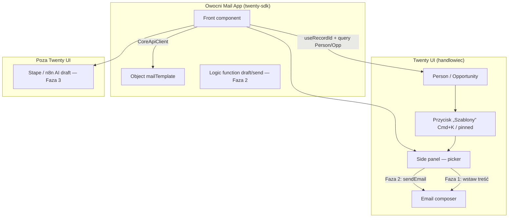

# E12.3 — strategia szablonów maili (Twenty-only)

**Twarde wymaganie:** handlowcy **nie używają better-bitrix** do codziennej pracy. Wszystko w **Twenty**.

**Problem platformy:** Twenty Cloud (2026) nie ma natywnej biblioteki Message Templates ani pickera w composerze (docs Mintlify nieaktualne).

**Odrzucone:**
- import do Notes (copy-paste),
- dual compose przez BB,
- jakiekolwiek codzienne odesłanie do BB.

**Rozwiązanie:** **Owocni Mail App** — oficjalna **Twenty Application** (`twenty-sdk`) z obiektem `mailTemplate` i front componentem „Szablony” w UI Twenty.

---

## 0. Decyzja (ADR #17 — zaktualizowana)

| Pole | Wartość |
|------|---------|
| **UX handlowca** | Tylko Twenty (+ panel Owocni **wewnątrz** Twenty) |
| **SSOT szablonów** | Obiekt **`mailTemplate`** w workspace Twenty (definicja w Owocni App) |
| **Migracja danych** | Jednorazowy import 19 szablonów z eksportu BB → rekordy `mailTemplate` |
| **BB** | Wyłączany; służy **tylko** jako źródło migracji (już wyeksportowane) |
| **Bloker cutover** | G-PAR PAR-5 wymaga działającego pickera w Twenty App |

---

## 1. Architektura — Owocni Mail App



### Dlaczego Twenty App (a nie osobna strona obok)

| Wymaganie | Twenty App |
|-----------|------------|
| Handlowiec nie wychodzi z Twenty | Front component w **side panel** (oficjalny mechanizm) |
| Kontekst leada | `useRecordId()` + `CoreApiClient` → Person/Opp |
| Picker jak w BB | Lista + kategorie w panelu |
| Edycja szablonów | Obiekt `mailTemplate` w Twenty (admin) |
| AI później | Logic function + webhook Stape |
| Bez fork Twenty | `twenty-sdk`, sandboxed worker |

Źródło: [Twenty Apps — Front Components](https://github.com/twentyhq/twenty/blob/main/packages/twenty-docs/developers/extend/apps/layout/front-components.mdx), [Command Menu Items](https://github.com/twentyhq/twenty/blob/main/packages/twenty-docs/developers/extend/apps/layout/command-menu-items.mdx).

---

## 2. Model danych — obiekt `mailTemplate`

Definicja w Owocni App (`defineObject`):

| Pole | Typ | Opis |
|------|-----|------|
| `name` | TEXT (auto base) | Nazwa szablonu (np. „LOGO - oferta”) |
| `subject` | TEXT | Temat maila |
| `bodyHtml` | TEXT | Treść HTML |
| `category` | SELECT | sales, helpdesk, website, logo, … |
| `priority` | SELECT | MUST / NICE |
| `bbLegacyId` | NUMBER | Id z BB (ślad migracji) |
| `isActive` | BOOLEAN | Archiwum |

**Seed:** skrypt `seed_mail_templates_to_twenty.py` — czyta `exports/bb_email_templates/` → `createMailTemplate` przez REST/GraphQL.

**Admin:** Dawid/sprzedaż edytuje szablony w Twenty (lista obiektów `Mail templates`) — **bez BB**.

---

## 3. UX handlowca (docelowy)

### Faza 1 — MVP picker (must-have przed cutover)

1. Handlowiec na **Person** lub **Opportunity** w Twenty.
2. Klik **„Szablony”** (pinned quick action, prawy górny róg) lub Cmd+K.
3. Side panel: filtr kategorii, podgląd, wybór szablonu.
4. App pobiera `firstName`, email, nazwę Opp z rekordu → podstawia zmienne w HTML.
5. **„Wstaw do odpowiedzi”:**
   - kopiuje subject+HTML do schowka,
   - otwiera panel compose Twenty (`CommandOpenSidePanelPage` — do zweryfikowania w spike),
   - snackbar: „Wklej treść (Ctrl+V)”.
6. Handlowiec wysyła z **Twenty composer** (ta sama skrzynka IMAP co dziś).

**PASS MVP:** jeden handlowiec wysyła mail z szablonu **bez BB** w &lt; 60 s.

### Faza 2 — Send bez wklejania (docelowy UX)

- Logic function / `CoreApiClient` → wywołanie **SendEmail** (backend Twenty, PR #19363) z `connectedAccountId` użytkownika.
- Panel: „Wyślij” zamiast „Wstaw”.
- Wątek w timeline Twenty natywnie.

**Spike wymagany:** czy SendEmail z App działa z kontekstem użytkownika (nie tylko API key workspace).

### Faza 3 — AI na szablonach

1. Wybór szablonu w panelu.
2. Przycisk **„Dopasuj AI”** → `POST` Stape/n8n: `{ templateId, personId, oppId, threadSummary? }`.
3. Zwrot HTML → podgląd → Wyślij (Faza 2) lub Wstaw (Faza 1).
4. Spójne z roadmapą Twenty (AI w composerze), ale **na naszej bibliotece szablonów**.

---

## 4. Fazy wdrożenia i pewność

| Faza | Zakres | Czas | Pewność | Gate |
|------|--------|------|---------|------|
| **S0** | Spike Twenty App: hello-world + `useRecordId` na sandbox | 0.5 dnia | Wysoka (docs + SDK) | Go/no-go na pełny MVP |
| **S1** | Obiekt `mailTemplate` + seed 19 szablonów | 1 dzień | Wysoka (REST create) | PAR-5.1 |
| **S2** | Front component picker + zmienne + wstaw do compose | 2–3 dni | Średnia (compose hook — spike) | PAR-5.2 MVP |
| **S3** | SendEmail z App (bez paste) | 2–3 dni | Średnia (wymaga spike) | PAR-5.2 docelowy |
| **S4** | AI draft | 3–5 dni | Średnia (Stape istnieje) | Po cutover OK |

**Cutover handlowców na Twenty** wymaga minimum **S1 + S2 PASS**.

---

## 5. Spike S0 (pierwszy krok — zanim cokolwiek obiecujemy)

| # | Test | PASS |
|---|------|------|
| S0.1 | `yarn twenty dev` — app zainstalowana w sandbox | ☐ |
| S0.2 | Pinned „Szablony” widoczny na Person/Opp | ☐ |
| S0.3 | `useRecordId()` zwraca ID aktualnego rekordu | ☐ |
| S0.4 | `CoreApiClient` odczytuje email Person | ☐ |
| S0.5 | `CommandOpenSidePanelPage` otwiera compose (lub udokumentowany fallback clipboard) | ☐ |

**Fail S0.5 bez alternatywy** → eskalacja do Twenty support / plan B (extension tylko dla `*.twenty.com`).

---

## 6. Mapowanie G-PAR / E12.3

| ID | Kryterium | Kiedy PASS |
|----|-----------|------------|
| PAR-5.0 | Strategia Twenty-only (ten dokument) | ☑ |
| PAR-5.1 | 19 `mailTemplate` w Twenty | Po S1 |
| PAR-5.2 | Wyślij z Twenty używając pickera App | Po S2 (MVP) lub S3 (docelowy) |
| PAR-5.3 | Evidence + szkolenie | Po S2 |
| E12.3 | Szablony + SOP w Twenty | Po S2 |
| E12.3c | Szkolenie (panel Szablony, nie BB) | Po S2 |

**G-PAR PAR-5 bez S2 = FAIL** — nie ma partial przez BB.

---

## 7. Co z better-bitrix

| BB | Rola |
|----|------|
| `email_template` Supabase | **Tylko migracja** — dane już w `exports/bb_email_templates/` |
| Picker / inbox BB | **Wyłączyć** po cutover (E12.4) |
| Codzienna praca | **Zakazana** od momentu przejścia handlowców |

---

## 8. Struktura repo (plan)

```
owocni-crm-github/
  apps/owocni-mail-twenty/          # Twenty App (twenty-sdk)
    src/
      objects/mail-template.object.ts
      front-components/template-picker.tsx
      command-menu-items/templates.command-menu-item.ts
      logic-functions/                # Faza 2–3
  integrations/tools/
    seed_mail_templates_to_twenty.py  # S1 — import z exports/
    export_bb_email_templates.py      # już jest (archiwum BB)
```

---

## 9. Ryzyka i plan B

| Ryzyko | Plan B |
|--------|--------|
| SendEmail z App niedostępny dla user context | MVP S2: clipboard + compose panel; S3 jako fast-follow |
| Compose nie przyjmuje HTML z paste | Wysyłka przez Logic function + SMTP Twenty (S3 priorytet) |
| Twenty App SDK niestabilny | Extension Chrome **tylko** `*.twenty.com` — picker inject (więcej utrzymania) |
| Twenty wyda native templates | Porównaj; deprecuj App; migracja `mailTemplate` → native |

---

## 10. Następne kroki

1. ☑ Strategia Twenty-only (ten dokument)
2. ☐ Zatwierdzenie ADR #17 przez właściciela
3. ☐ **Spike S0** — scaffold `apps/owocni-mail-twenty` + install sandbox
4. ☐ S1 seed 19 szablonów
5. ☐ S2 picker MVP → PAR-5
6. ☐ Równolegle: E12.3b `leads@` (niezależne)

---

## CROSS-REFERENCES

| Temat | Plik |
|-------|------|
| Twenty Apps docs | `twentyhq/twenty` → `packages/twenty-docs/developers/extend/apps/` |
| Eksport BB (migracja) | `exports/bb_email_templates/` |
| Szkolenie | `E12_3_EMAIL_TEMPLATES_AND_TRAINING.md` |
