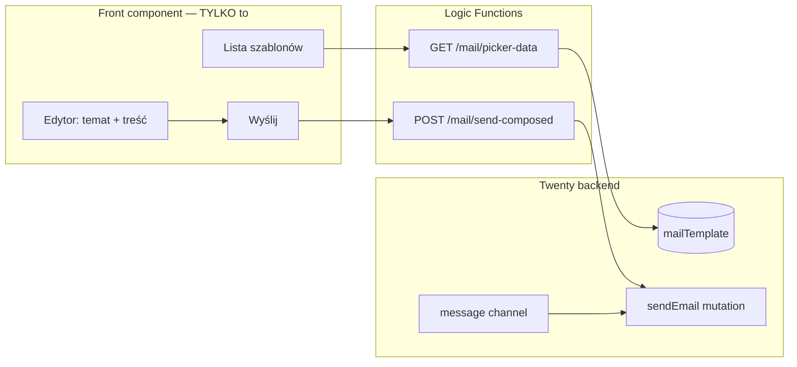

# E12.4 — Owocni Mail: plan resetu i wdrożenia

**Cel dokumentu:** przestać wdrażać „po omacku”. Najpierw spike’i z PASS/FAIL, potem jeden stabilny UX, potem wysyłka.

**Stan na dziś:** S1 PASS (19 szablonów). **PAR-5.2 PASS** sandbox (2026-06-16) — picker, edytor wizualny, wysyłka, zamknięcie panelu. Szkolenie (PAR-5.3) OPEN.

---

## 1. Czego oczekujesz (Product — nie negocjujemy)

| # | Oczekiwanie | Miara sukcesu |
|---|-------------|---------------|
| O1 | Handlowiec pracuje **tylko w Twenty** (bez BB, bez schowka jako głównej ścieżki) | 0 kroków poza Twenty UI |
| O2 | **Person → Szablony → wybór szablonu** | Lista 19 szablonów, filtr, kontekst osoby (email, imię) |
| O3 | **Edytor przed wysłaniem** — temat + treść do poprawy | Handlowiec zmienia tekst w panelu, widzi sensowny podgląd treści |
| O4 | **Wyślij z panelu** — jeden przycisk, mail idzie | Potwierdzenie „Wysłano do …”, wpis w timeline Twenty |
| O5 | **Stabilność** — brak białych ekranów / „Sorry, something went wrong” | 10× wybór szablonu bez crashu na sandboxie |
| O6 | Cutover **G-PAR PAR-5.2** | 1 handlowiec wysyła mail z szablonu bez BB w &lt; 60 s |

---

## 2. Co udowodniliśmy empirycznie (Twenty — twarde ograniczenia)

Te punkty wynikają z testów na sandboxie `zany-maroon-panther.twenty.com`, nie z dokumentacji.

| ID | Fakt | Skutek dla nas |
|----|------|----------------|
| T1 | Front component działa w **sandboxowanym workerze** | Brak `window.open`, ograniczone API DOM |
| T2 | Import `CoreApiClient` / `MetadataApiClient` w front component | Crash ładowania chunków — **zakazane** |
| T3 | Jedyny bezpieczny klient w UI: **`RestApiClient` → Logic Functions** | Cała logika serwerowa w `*.logic-function.ts` |
| T4 | `openSidePanelPage(ComposeEmail)` **bez** `connectedAccountId` | Pusty biały panel (`SidePanelComposeEmailPage` zwraca `null`) |
| T5 | SDK **nie przekazuje** parametrów compose (`defaultTo`, `defaultSubject`, body) | **Nie da się** programowo otworzyć natywnego composera z treścią |
| T6 | `dangerouslySetInnerHTML` / `contentEditable` + HTML z BB | Crash całej aplikacji Twenty („Sorry, something went wrong”) |
| T7 | `sendEmail` (Metadata API) wymaga **sesji użytkownika** | API key → „This endpoint requires a user context” |
| T8 | `sendEmail` wymaga konta z **message channel** (zsynchronizowana skrzynka) | Błąd: `No message channel found for connected account '…'` |
| T9 | 13/19 szablonów BB miało **pusty subject** w eksporcie | Temat trzeba uzupełniać w edytorze lub w rekordzie `mailTemplate` |

**Wniosek:** Docelowy UX (O3–O4) **jest osiągalny**, ale **nie** przez natywny composer Twenty z poziomu App — tylko przez **własny edytor w panelu + sendEmail z Logic Function**, po spełnieniu T8.

---

## 3. Decyzja architektoniczna (jedna ścieżka — bez rozgałęzień)



| Warstwa | Dozwolone | Zakazane |
|---------|-----------|----------|
| Front component | `RestApiClient`, proste kontrolki React (`input`, `textarea`), snackbar | `CoreApiClient`, `MetadataApiClient`, `dangerouslySetInnerHTML`, `contentEditable`, `openSidePanelPage(ComposeEmail)`, schowek jako główny flow |
| Logic function | `CoreApiClient`, `MetadataApiClient`, `sendEmail` | Zgadywanie bez logowania błędów |

**Odrzucone na stałe (do czasu zmiany SDK Twenty):**
- Otwieranie natywnego composera z prefillem treści
- Podgląd HTML przez wstrzykiwanie surowego BB HTML w React
- Copy-paste jako docelowa ścieżka wysyłki

---

## 4. Fazy wdrożenia — tylko z bramkami PASS/FAIL

Żadna faza nie startuje, dopóki poprzednia nie ma **PASS na sandboxie** (checklist poniżej).

### Faza P0 — Stabilizacja pickera (0,5 dnia)

**Cel:** O1, O2, O5 — lista + edytor tekstowy, zero crashy.

| Zadanie | Opis |
|---------|------|
| P0.1 | Front component: lista szablonów + `textarea` (temat + treść) — **bez** podglądu HTML |
| P0.2 | GET `/mail/picker-data` — szablony + person (bez Metadata w tej samej transakcji jeśli ryzyko; opcjonalnie osobny endpoint konta) |
| P0.3 | Przycisk „Wyślij” **wyłączony** lub ukryty do P2 |
| P0.4 | Test regresji: 10× wybór różnych szablonów — brak crashu |

**PASS P0:** Dawid otwiera 5 różnych szablonów (w tym najdłuższe HTML z BB) — panel działa, edytor pokazuje treść.

---

### Faza P1 — Prerequisite: konto email (0,5 dnia, **Ty / admin**)

**Status 2026-06-16:** sync konta zakończony (PASS częściowy). Natywny **Reply** w Twenty otwiera edytor, ale:
- wielokrotny **React #185** (Maximum update depth exceeded) w konsoli,
- ekstremalne spowolnienie strony (Firefox: „strona spowalnia przeglądarkę”),
- pisanie maila praktycznie niemożliwe.

**Test izolacji (obowiązkowy przed P2):**
1. Settings → Applications → **wyłącz Owocni Mail**
2. Odśwież, otwórz Reply na mailu — czy nadal #185 i lag?
3. Jeśli **TAK** → bug **Twenty core** (zgłoszenie do support / issue na GitHub)
4. Jeśli **NIE** → nasza app obciąża UI — optymalizacja (lazy load treści szablonów, `GLOBAL_OBJECT_CONTEXT`)

**Optymalizacja App (wdrożona):** lista szablonów bez HTML; treść ładowana dopiero po kliknięciu (`GET /mail/template`).

**Wynik testu izolacji (2026-06-16):** po **Uninstall Owocni Mail** nadal React #185 + lag → **FAIL P1b** (Twenty core).

**Update:** Twenty support naprawił composer / wysyłkę — **P1b PASS** (potwierdzenie użytkownika). Kontynuacja **P2** (wysyłka z panelu Szablony).

| Krok | Akcja | Status |
|------|--------|--------|
| P1.1 | Settings → Accounts → sync zakończony | ☑ PASS |
| P1.2 | Natywny Reply / Send Email | ☑ otwiera się, **FAIL** wydajność |
| P1.3 | Uninstall Owocni Mail → Reply | ☑ **nadal #185 + lag** |
| P1.4 | `GET /mail/send-readiness` | wdrożona |

**PASS P1:** `send-readiness` zwraca `canSend: true` + natywny Send Email w Twenty działa ręcznie.

---

### Faza P2 — Spike wysyłki z App (1 dzień)

**Cel:** Udowodnić O4 technicznie, zanim zbudujemy „ładny” edytor.

| Test | Metoda | PASS |
|------|--------|------|
| P2.1 | POST `/mail/send-composed` z minimalnym body (`<p>test</p>`) na **własny email** | `{ ok: true }` |
| P2.2 | Mail dociera na skrzynkę | Inbox |
| P2.3 | Wpis w timeline Person w Twenty | Widoczny |
| P2.4 | Błąd bez message channel | Czytelny komunikat PL, nie 502 |

**FAIL P2:** eskalacja do Twenty support / zmiana providera email — **nie** kolejne hacki w UI.

---

### Faza P3 — Edytor docelowy (1–2 dni, po PASS P2)

**Cel:** O3 — edycja sensowna dla handlowca (nie surowy HTML jako domyślny widok).

| Opcja | Opis | Ryzyko |
|-------|------|--------|
| **A (zalecana)** | `textarea` + osobny endpoint `POST /mail/preview` zwraca **sanitized HTML** renderowany jako **obrazek/PDF** lub plain-text preview w iframe `srcdoc` z **sanitized** HTML po stronie LF | Niskie — sanitization na serwerze |
| **B** | Szablony BB przepisane na **uproszczony Markdown/plain** w polu `bodyPlain` | Średnie — migracja treści |
| **C** | Rich text (TipTap) w front component | **Wysokie** — worker / bundle; spike osobno |

**PASS P3:** Handlowiec edytuje treść bez widoku tagów HTML (lub z jawnym trybem „Zaawansowany HTML”).

**Status 2026-06-16:** **PASS** — edytor iframe blob + draft serwerowy (`POST /mail/editor-draft`). Fallback „Kod HTML”. Panel zamyka się po wysyłce (`closeSidePanel`). Strona Owocni Mail bez `twenty-sdk/ui`.

---

### Faza P4 — MVP cutover (1 dzień)

| Zadanie | Opis |
|---------|------|
| P4.1 | Włączyć „Wyślij email” tylko gdy `send-readiness.canSend` |
| P4.2 | Uzupełnić puste tematy w 13 szablonach (seed / ręcznie w Twenty) |
| P4.3 | SOP 1 strona dla handlowców |
| P4.4 | **PAR-5.2** — 1 handlowiec, 1 mail, bez BB, &lt; 60 s |

---

### Faza P5 — Później (po cutover)

- AI draft (Stape/n8n) — logic function
- Ostatnio użyte szablony
- Opp context (nie tylko Person)
- Reply-in-thread (`inReplyTo`)

---

## 5. Spike checklist (wypełnić przed kodem UI)

Skopiuj do issue / Notion; każdy punkt: **PASS / FAIL / data / kto**.

```
[x] S0  Front component skeleton — side panel bez crashu
[x] S1  19 mailTemplate w Twenty
[x] P0  10× wybór szablonu — bez crashu
[x] P1  Natywny Send Email w Twenty działa na sandboxie
[x] P1  GET /mail/send-readiness → canSend: true
[x] P2  POST send-composed → mail na inbox
[ ] P2  Timeline Person po wysyłce
[x] P3  Edytor bez surowego HTML jako domyślny widok
[x] P4  PAR-5.2 — handlowiec end-to-end (sandbox, Dawid 2026-06-16)
[ ] P4  PAR-5.3 — szkolenie handlowców
```

---

## 6. Co robimy **teraz** (konkretne następne kroki)

| Kolejność | Kto | Akcja |
|-----------|-----|--------|
| 1 | Dev | **P0:** picker = lista + textarea, **zero** `dangerouslySetInnerHTML`, Wyślij wyłączony |
| 2 | Dawid | **P1:** Settings → Accounts — dokończyć sync skrzynki; test natywnego Send Email |
| 3 | Dev | **P1:** endpoint `GET /mail/send-readiness` |
| 4 | Dev + Dawid | **P2 spike** — jeden testowy mail z logic function; wynik zapisany w `E12_EMAIL_SYNC_EVIDENCE.md` |
| 5 | Dev | Dopiero po PASS P2: włączyć Wyślij + P3 edytor |

**Nie robimy** aż P0 PASS: nowych przycisków compose, podglądu HTML w React, kolejnych wariantów schowka.

---

## 7. Ryzyka i mitigacja

| Ryzyko | Prawdop. | Mitigacja |
|--------|----------|-----------|
| Twenty nigdy nie doda compose prefill w SDK | Średnie | Własny edytor + sendEmail (ten plan) |
| Message channel nie sync u handlowca | Wysokie | P1 obowiązkowy przed cutover; SOP Accounts |
| BB HTML psuje UI | Pewne | Sanitize na LF; długoterminowo uproszczenie treści |
| sendEmail wymaga uprawnienia SEND_EMAIL_TOOL | Średnie | Sprawdzić role workspace; spike P2 |

---

## 8. Definition of Done (cały projekt Owocni Mail MVP)

- [x] PAR-5.1 — 19 szablonów w Twenty
- [x] PAR-5.2 — wysyłka z pickera bez BB (sandbox 2026-06-16)
- [ ] PAR-5.3 — evidence ☑ + **szkolenie OPEN**
- [x] Brak crashy przy wyborze szablonu (O5)
- [ ] Handlowiec nie używa schowka do wysyłki (O1, O4) — weryfikacja po szkoleniu

---

## 9. Powiązane pliki

| Plik | Rola |
|------|------|
| `apps/owocni-mail-twenty/src/front-components/template-picker.tsx` | UI — tylko po PASS spike |
| `apps/owocni-mail-twenty/src/logic-functions/` | API serwerowe |
| `integrations/tools/seed_mail_templates_to_twenty.py` | Seed szablonów |
| `integrations/runbooks/E12_3_EMAIL_TEMPLATE_STRATEGY.md` | Strategia pierwotna |
| `apps/owocni-mail-twenty/IMPLEMENTATION_CHECKLIST.md` | Checklist techniczny (do sync z tym dokumentem) |

---

## 10. Szablon zgłoszenia do Twenty (GitHub / support)

Skopiuj i uzupełnij (np. issue na https://github.com/twentyhq/twenty/issues/new):

```markdown
### Describe the bug
After connecting and syncing an email account, opening **Reply** on a message (side panel email composer) causes:
- Repeated **Minified React error #185** (Maximum update depth exceeded) in the browser console
- Severe UI lag; Firefox warns the page is slowing down the browser
- Typing in the composer is practically impossible

### Isolation
- Reproduces with **no third-party apps installed** (Owocni Mail app uninstalled from Settings → Applications)
- Workspace: Owocni sandbox (Twenty Cloud)

### Environment
- URL: https://zany-maroon-panther.twenty.com
- Browser: Firefox (also test Chrome if possible)
- Email: [your provider, e.g. Gmail / IMAP]
- Sync status: completed

### Steps to reproduce
1. Connect email in Settings → Accounts and wait for sync to complete
2. Open a Person with synced email thread
3. Click Reply on an existing message
4. Open browser console — observe React #185 repeating
5. Try typing in the body — observe extreme lag

### Expected
Composer opens once, no console errors, normal typing performance.

### Actual
Infinite or near-infinite React updates (#185), page becomes unresponsive.
```
