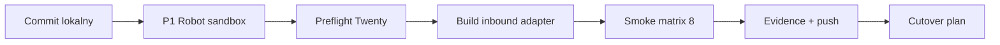

# Kolejne kroki — integrations po punkcie 17

**Stan wejściowy (2026-06-02):** archiwum `integrations/archive/`, normalizacja `event_name` w Robot + Sortownia paid, brak adaptera `inbound:twenty_webhook` w repo.

**Cel:** przejść od „kod częściowo zgodny z SSOT” do **PASS G1–G4 + smoke matrix** na sandboxie, potem commit evidence i dopiero plan cutover.

---

## Mapa faz (kolejność obowiązkowa)

| Faza | Runbook | Bramy / parity | Szacunek | Blokuje |
|------|---------|----------------|----------|---------|
| **0** | [COMMIT_PHASE0.md](./COMMIT_PHASE0.md) | — | 30 min | nic (opcjonalnie przed testami) |
| **1** | [SANDBOX_PHASE1_ROBOT_EVENTS.md](./SANDBOX_PHASE1_ROBOT_EVENTS.md) | P1, G1 (część) | 1–2 h | fazę 3 |
| **2** | [PREFLIGHT_TWENTY_WEBHOOK.md](./PREFLIGHT_TWENTY_WEBHOOK.md) | G2 (przygotowanie) | 1–2 h | fazę 3 |
| **3** | [BUILD_INBOUND_TWENTY_WEBHOOK.md](./BUILD_INBOUND_TWENTY_WEBHOOK.md) | P3–P5, P7, P10, G2–G4 | 2–5 dni | fazę 4 |
| **4** | [SMOKE_MATRIX_EXECUTION.md](./SMOKE_MATRIX_EXECUTION.md) | G1–G4, L-1, smoke #1–#8 | 1–2 dni | cutover |
| **5** | [POST_SMOKE_EVIDENCE.md](./POST_SMOKE_EVIDENCE.md) | ADR #14, DECISION_REGISTER | 1 h | cutover |

---

## Szybka checklista (jedna strona)

- [ ] **F0** Commit: `integrations/` + ewentualnie `DECISION_REGISTER` / `IMPLEMENTATION_PLAN` (osobny commit docs)
- [ ] **F1** Wstaw fixture do Stape `task_queue` → uruchom Robot → logi: `purchase` / `rejected_lead`, brak surowego `lead_won` w GA4 MP
- [ ] **F2** Złap 1–2 surowe payloady webhooka Twenty + HMAC OK + zapisz w `fixtures/webhook-captures/` (gitignore jeśli PII)
- [ ] **F3** Tag Stape `inbound:twenty_webhook` z [../INBOUND_TWENTY_WEBHOOK.stub.js](../INBOUND_TWENTY_WEBHOOK.stub.js) → eksport do repo
- [ ] **F4** 8 scenariuszy z `EVENT_CONTRACT` §6.3 — każdy PASS + reason code
- [ ] **F5** Zaktualizuj `INTEGRATIONS_PARITY.md` (status P1–P10) + zamknij evidence w `DECISION_REGISTER`

---

## Pliki pomocnicze

| Plik | Rola |
|------|------|
| `./LLM_ANTI_WPADKI_GO_NO_GO.md` | Jednostronicowy filtr bezpieczeństwa przed deployem/pracą z LLM |
| `../fixtures/README.md` | Jak używać JSON do testów task_queue |
| `../fixtures/task-queue-*.json` | Przykładowe taski (kanon + legacy) |
| `../INBOUND_TWENTY_WEBHOOK.stub.js` | Szkielet adaptera (Stape) — **nie deploy bez review** |
| `../INTEGRATIONS_PARITY.md` | Macierz P1–P10 — aktualizuj po każdej fazie |

---

## Czego NIE robić przed smoke #4 PASS

1. Usuwać `srcSystem`-SKIP w ścieżce backfill (`EVENT_CONTRACT` §6.1, L-1).
2. Wysyłać sandbox do produkcyjnych adapterów Google/Meta (G10 / env-guard).
3. Używać `integrations/archive/` jako źródła implementacji.
4. Ustalać daty cutover „z góry” (`DECISION_REGISTER` §5.8).

---

## CROSS-REFERENCES

| Temat | Plik |
|-------|------|
| 8 scenariuszy go/no-go | `../../owocni-crm/EVENT_CONTRACT.md` §6.3 |
| MUST-PASS G1–G8 | `../../owocni-crm/runbooks/IMPLEMENTATION_PLAN.md` §5.4 |
| HMAC / nazwa pola `event` | `../../owocni-crm/ops/OPS_NOTES.md` |
| Macierz parity | `../INTEGRATIONS_PARITY.md` |
