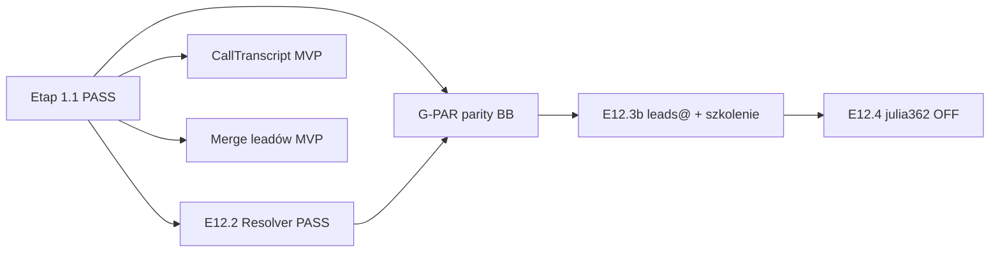

# Kolejne kroki — lipiec 2026

**Stan:** Etap **1.1 zamknięty** (T1→WF, GCP `gcp-v5` inbound, worker + smoke + workflowy SQL/odrzucenie).  
**Nowe (2026-07-21):** kanał telefon (CallTranscript) + merge leadów — MVP na sandbox.  
**Cutover:** nadal **NIE** — brama **G-PAR** otwarta + szkolenie PAR-5.3 + E12.3b `leads@`.

**Master plan:** [TWENTY_ROLLOUT_MASTER.md](./TWENTY_ROLLOUT_MASTER.md)

---

## Mapa — gdzie jesteśmy

| Faza | Status | Runbook |
|------|--------|---------|
| T1–WF (schema, webhook, GCP, smoke, workflowy) | ✅ 2026-07-10 | `TWENTY_ROLLOUT_MASTER` |
| E12.1 Email Sync (7 skrzynek) | ✅ | `E12_EMAIL_SYNC_EVIDENCE` |
| E12.2 Identity Resolver | ✅ | `BUILD_IDENTITY_RESOLVER` |
| Owocni Mail PAR-5.2 | ✅ sandbox | `E12_EMAIL_SYNC_EVIDENCE` §G-PAR |
| **Kanał telefon Play → Twenty** | ✅ MVP sandbox 2026-07-21 | `CALL_INGEST_N8N.contract` · `BUILD_CALL_TRANSCRIPT_TWENTY_SCHEMA` |
| **Merge leadów (ręczne)** | ✅ MVP sandbox 2026-07-21 | `MERGE_LEADS` · IDENTITY §5.9 |
| **G-PAR** (pełna parzystość BB) | **OPEN** | `G_PAR_BETTER_BITRIX_PARITY` |
| E12.3b rozdział `leads@` | OPEN | `E12_3_EMAIL_TEMPLATES_AND_TRAINING` §B |
| PAR-5.3 szkolenie handlowców | OPEN | `E12_4_P4_CUTOVER_INSTRUCTIONS` |
| E12.4 wyłączenie julia362 | po G-PAR | `E12_4_OWOCNI_MAIL_RESET_PLAN` |
| Call: summary LLM + archiwum dropów GCS | backlog | `CALL_INGEST_N8N.contract` |
| Merge: propozycje `company_domain_key` | backlog | IDENTITY §5.8.2 |

---

## Co robić teraz (kolejność)

### 0. Operacyjnie — telefon + merge (już na sandbox)

| Co | Gdzie |
|----|-------|
| Parking rozmów | Twenty → **Rozmowy → Do przypięcia** |
| Przypnij do leada | Pole **Szansa** na rozmowie (webhook sync) |
| Nowy lead z rozmowy | Przycisk **Utwórz lead z rozmowy** |
| Scal dwa leady | Przycisk **Scal z leadem** (picker Opportunity) |
| Kontrakty | `CALL_INGEST_N8N.contract.md`, `MERGE_LEADS.md` |

**Weryfikacja E2E:** poczekać na cron Play / `node run.js` — w Twenty powinny wpadać prawdziwe rozmowy (nie tylko smoke).

### 1. G-PAR — parzystość Better-Bitrix (~1–2 dni)

**Runbook:** [G_PAR_BETTER_BITRIX_PARITY.md](./G_PAR_BETTER_BITRIX_PARITY.md)

| Priorytet | ID | Akcja | Kto |
|-----------|-----|-------|-----|
| 1 | PAR-2.4 | LOST → brak eventu w `task_queue` | Agent zweryfikował kod; Dawid: 1× drag na LOST + screenshot braku taska |
| 2 | PAR-3 | 7 skrzynek — timeline w Twenty | Dawid (checklist 7 wierszy) |
| 3 | PAR-4 | SOP `leads@` → owner | Dawid + `E12_3` §B |
| 4 | PAR-1 | Demo kanban z handlowcem | Dawid + 1 handlowiec |
| 5 | PAR-5.3 | SOP + szkolenie 15 min | Dawid → sprzedaż |

PAR-2.1–2.3, 2.5 i PAR-6 mają dowód ze smoke 2026-06-15 + rozszerzenia 2026-07 (SQL gate, odrzucenie, `biz_value`).

**Evidence:** uzupełnij `E12_EMAIL_SYNC_EVIDENCE.md` §G-PAR po każdej sesji.

### 2. Opcjonalnie — selektywne czyszczenie Twenty

**Runbook:** [E12_EMAIL_SYNC_EXECUTION.md](./E12_EMAIL_SYNC_EXECUTION.md) FAZA 0

Sandbox ma **~116** Opportunity (mieszanka leadów Sortowni i testów). **Nie** rób masowego delete — usuń tylko rekordy z nazwą `test`, `smoke`, `wf test` itd. Zostaw leady prod z Sortowni (`Yaroslav`, `Sylwia`, …).

### 3. Po G-PAR PASS

1. [E12_4_P4_CUTOVER_INSTRUCTIONS.md](./E12_4_P4_CUTOVER_INSTRUCTIONS.md) — prod sync Owocni Mail  
2. [E12_4_OWOCNI_MAIL_RESET_PLAN.md](./E12_4_OWOCNI_MAIL_RESET_PLAN.md) — wyłączenie julia362  
3. Prod inbound: `twenty-inbound-webhook-prod` lub rollback legacy Stape tag

---

## Utrzymanie operacyjne (ciągłe)

| Co | Kiedy | Dowód |
|----|-------|-------|
| Deploy inbound CF | Po zmianie `processWebhook.js` | `build_id: 2026-07-10-gcp-v5` w curl |
| Deploy Robot | Po zmianie `GoogleCloudRobot.js` | revision w Cloud Run |
| Deploy CRM worker | Po zmianie call/merge/create_lead | Cloud Run revision + smoke action |
| Publish Stape | Po zmianie stubów | Incoming 200 na `/inbound/twenty_webhook` |
| `INTEGRATIONS_PARITY` | Po każdej fazie | P12–P17 |

---

## Czego NIE robić

1. Wyłączać julia362 przed **G-PAR PASS** (ADR #13).
2. Podłączać `kontakt@` do Twenty Email Sync.
3. Usuwać `srcSystem`-SKIP na backfill przed zamknięciem L-1 (jeśli kiedyś dodany).
4. Commitować `.env.local` / hasła skrzynek.
5. Auto-merge leadów / tożsamości (NR-5, IDENTITY §5.9).

---

## CROSS-REFERENCES

| Temat | Plik |
|-------|------|
| 8+ scenariuszy eventów | `owocni-crm/EVENT_CONTRACT.md` §6.3 |
| Bramy G1–G8, G-PAR | `owocni-crm/runbooks/IMPLEMENTATION_PLAN.md` §5.4 |
| Macierz parity kodu | `../INTEGRATIONS_PARITY.md` |
| Workflowy SQL/odrzucenie | `TWENTY_WORKFLOWS_REJECT_AND_GUARD.md` |
| Migracja GCP | `MIGRATE_TWENTY_CRM_TO_GCP.md` |
| Telefon Play → Twenty | `CALL_INGEST_N8N.contract.md` |
| Merge leadów | `MERGE_LEADS.md` |
