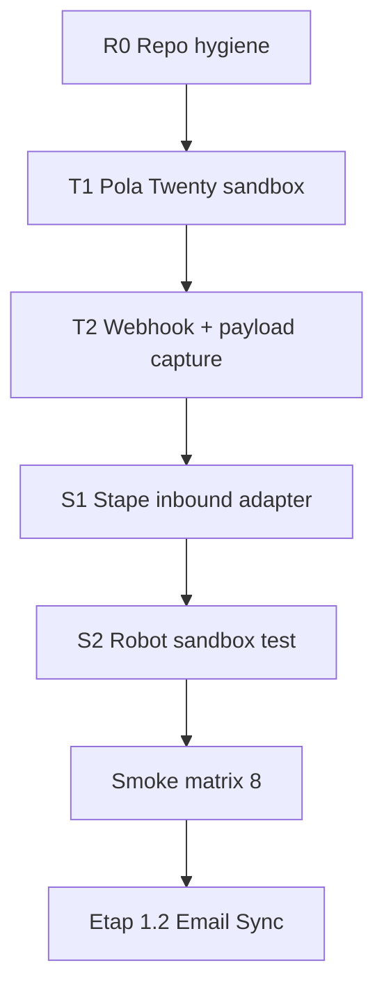

# Plan wdrożenia Twenty — master checklist

**Review SSOT:** PASS 2026-06-08 (`REVIEW_PACKAGE.md` §3).  
**Cutover:** nadal po PASS G1–G8 + G-PAR + zamknięciu ADR z dowodem.  
**Ten dokument:** kolejność prac **teraz** — sandbox Twenty + integracje zewnętrzne.

## Legenda wykonawcy

| Symbol | Kto | Jak |
|--------|-----|-----|
| **🤖 REPO** | Agent / Dawid w Cursor | Pliki w `integrations/`, `owocni-crm/`, commit do GitHub |
| **🔌 TWENTY-API** | **Agent (preferowane)** | Metadata GraphQL `https://api.twenty.com/metadata` + skrypt `integrations/tools/twenty_schema.py` — **tak jak POC 2026-05-25** |
| **☁️ TWENTY-UI** | Dawid tylko gdy API nie wystarczy | [zany-maroon-panther.twenty.com](https://zany-maroon-panther.twenty.com) — webhooks, Email Sync, kanban |
| **📦 STAPE** | Dawid | Stape UI — tagi, zmienne, Store |
| **☁️ GCP** | Dawid | Google Cloud Function Robot — deploy z repo |

**Instancja:** `https://zany-maroon-panther.twenty.com` (workspace Owocni).  
**Sekrety:** `.env.local` w root repo (wzór `.env.example`) — **nigdy do git**.

**Zasada:** T1 (pola, stage) = **API przez agenta**. UI tylko dla webhooków / maili / rzeczy bez endpointu w Metadata API.

---

## Mapa faz (kolejność obowiązkowa)

| Faza | Cel | Bramy | Szacunek |
|------|-----|-------|----------|
| **R0** | Repo gotowe, bez sekretów w kodzie | — | 1 h |
| **T1** | Pola FROZEN + stage + pipeline w Twenty | przygotowanie G2/G-PAR | 2–3 h |
| **T2** | Webhook OUT + 4 payloady + HMAC | G2 webhook-truth | 1–2 h |
| **S1** | Tag `inbound:twenty_webhook` w Stape | G2–G4 (część) | 2–5 dni |
| **S2** | Robot + task_queue fixtures | G1 (część) | 1–2 h |
| **SM** | 8 scenariuszy `EVENT_CONTRACT` §6.3 | G1–G4, L-1 | 1–2 dni |
| **E12** | Email Sync + Resolver | G7, G-PAR | osobny sprint |

---

## R0 — Repo (🤖 REPO) — **w toku**

| ID | Zadanie | Status | Dowód |
|----|---------|--------|-------|
| R0.1 | Plan master (ten plik) + runbooki T1/T2 | ☑ | commit |
| R0.2 | Usunąć hardcoded Stape API key z `INBOUND_TWENTY_WEBHOOK.js` | ☑ | commit |
| R0.3 | `parseTwentyPayload()` — TODO do uzupełnienia po T2 | ☐ | po T2 |
| R0.4 | Eksport schemy Twenty → `generated/twenty-schema.snapshot.json` | ☐ | po T1 |
| R0.5 | Zaktualizować `INTEGRATIONS_PARITY.md` po każdej fazie | ☐ | ciągłe |

---

## T1 — Twenty schema (🔌 TWENTY-API — agent)

**Runbook API:** [TWENTY_SANDBOX_STEP01_FIELDS.md](./TWENTY_SANDBOX_STEP01_FIELDS.md) (sekcja API)  
**Narzędzie:** `python3 integrations/tools/twenty_schema.py audit`

| ID | Zadanie | Status | Dowód |
|----|---------|--------|-------|
| T1.0 | `TWENTY_API_KEY` w `.env.local` (Settings → Developers) | ☐ | audit bez 403 |
| T1.1 | Audit schema vs `DATA_MODEL.md` | ☐ | `twenty_schema.py audit` |
| T1.2 | Opportunity: custom fields (agent: Metadata API) | ☐ | audit PASS |
| T1.3 | Person: `idOid` unique | ☐ | audit PASS |
| T1.4 | `stage` = NEW…LOST (updateOneField) | ☐ | audit stage |
| T1.5 | `campaignRejected` label „Odrzuć leada" | ☐ | API / UI |
| T1.6 | `srcSystem` SELECT opcje | ☐ | audit |
| T1.7 | Kanban view (opcjonalnie UI) | ☐ | |
| T1.8 | Snapshot → `generated/twenty-schema.snapshot.json` | ☐ | commit |

**PASS T1:** `twenty_schema.py audit` = 0 brakujących pól + stage zgodny.

**Ty tylko raz:** wygeneruj API key jeśli wygasł / brak w `.env.local`.

---

## T2 — Webhook preflight (☁️ TWENTY + 📦 STAPE)

**Runbook:** [TWENTY_SANDBOX_STEP02_WEBHOOK.md](./TWENTY_SANDBOX_STEP02_WEBHOOK.md) · szczegóły: [PREFLIGHT_TWENTY_WEBHOOK.md](./PREFLIGHT_TWENTY_WEBHOOK.md)

| ID | Zadanie | Status | Dowód |
|----|---------|--------|-------|
| T2.1 | Native webhook OUT (nie Workflow HTTP) | ☐ | |
| T2.2 | URL → endpoint Stape `/inbound/twenty_webhook` (lub webhook.site na pierwszy test) | ☐ | |
| T2.3 | Secret HMAC → zmienna Stape `twenty_webhook_secret` | ☐ | |
| T2.4 | Obiekty: Opportunity + Person, create + update | ☐ | |
| T2.5 | Przechwyć 4 payloady (A–D z PREFLIGHT) | ☐ | `fixtures/webhook-captures/` |
| T2.6 | Odpowiedz na OQ-E2, OQ-E3 w `OPS_NOTES.md` | ☐ | `[D:VERIFIED]` |

**PASS T2:** HMAC OK + ≥4 JSON + wiemy gdzie są `stage`, `campaignRejected`, `idOid`.

**Po PASS:** 🤖 REPO — dopasuj `parseTwentyPayload()` w `INBOUND_TWENTY_WEBHOOK.js`.

---

## S1 — Stape: adapter inbound (📦 STAPE + 🤖 REPO)

**Runbook:** [BUILD_INBOUND_TWENTY_WEBHOOK.md](./BUILD_INBOUND_TWENTY_WEBHOOK.md)

| ID | Zadanie | Status | Dowód |
|----|---------|--------|-------|
| S1.1 | Zmienne kontenera: `stape_base_url`, `stape_store_api_key`, `twenty_webhook_secret`, `environment=sandbox` | ☐ | Stape UI |
| S1.2 | HTTP tag z kodem `INBOUND_TWENTY_WEBHOOK.js` | ☐ | |
| S1.3 | Stape Store: klucze `twenty:opp:{id}:last_stage` itd. | ☐ | |
| S1.4 | Pending-write TTL (loop prevention) | ☐ | |
| S1.5 | Eksport działającego tagu → commit repo | ☐ | git |

**NIE przed smoke #4:** usuwać `srcSystem`-SKIP na backfill (L-1).

---

## S2 — Robot sandbox (☁️ GCP + 📦 STAPE)

**Runbook:** [SANDBOX_PHASE1_ROBOT_EVENTS.md](./SANDBOX_PHASE1_ROBOT_EVENTS.md)

| ID | Zadanie | Status | Dowód |
|----|---------|--------|-------|
| S2.1 | Wstaw fixture `task-queue-purchase-canonical.json` do `task_queue` | ☐ | log Robot |
| S2.2 | Legacy `lead_won` → normalizacja → `purchase` | ☐ | log |
| S2.3 | `environment=sandbox` → brak prod Google/Meta API | ☐ | log SKIP |

---

## SM — Smoke matrix (📦 STAPE + ☁️ TWENTY)

**Runbook:** [SMOKE_MATRIX_EXECUTION.md](./SMOKE_MATRIX_EXECUTION.md)

| # | Scenariusz | Status |
|---|------------|--------|
| 1 | QUALIFIED → qualify_lead | ☐ |
| 2 | WON → purchase | ☐ |
| 3 | campaignRejected → rejected_lead | ☐ |
| 4 | Manual create + backfill (L-1) | ☐ |
| 5–8 | Pozostałe z §6.3 | ☐ |

**PASS SM:** wszystkie PASS + evidence → [POST_SMOKE_EVIDENCE.md](./POST_SMOKE_EVIDENCE.md).

---

## E12 — Etap 1.2 (po SM PASS)

| ID | Zadanie | Owner |
|----|---------|-------|
| E12.1 | Email Sync skrzynki (`IDENTITY` §5.5) | ☁️ TWENTY |
| E12.2 | Identity Resolver T1–T5 w Stape | 📦 STAPE |
| E12.3 | Szablony maili z BB | ☁️ TWENTY |
| E12.4 | Wyłączenie julia362 | po G7 + G-PAR |

---

## Co robimy **teraz**

1. **Ty (jednorazowo):** skopiuj `.env.example` → `.env.local`, wklej `TWENTY_API_KEY` z [Twenty Developers](https://zany-maroon-panther.twenty.com/settings/developers) (lub `export` w terminalu Cursor).
2. **Agent:** `python3 integrations/tools/twenty_schema.py audit` → uzupełnienie brakujących pól przez Metadata API (jak w POC).
3. **Ty tylko przy T2:** native webhook w UI (API webhooków bywa ograniczone) + ewentualny login w przeglądarce.

---

## CROSS-REFERENCES

| Temat | Plik |
|-------|------|
| Pola FROZEN | `owocni-crm/DATA_MODEL.md` |
| 8 testów | `owocni-crm/EVENT_CONTRACT.md` §6.3 |
| Bramy G1–G8 | `owocni-crm/runbooks/IMPLEMENTATION_PLAN.md` §5.4 |
| Macierz parity | `integrations/INTEGRATIONS_PARITY.md` |
| Anti-wpadki | `LLM_ANTI_WPADKI_GO_NO_GO.md` |
