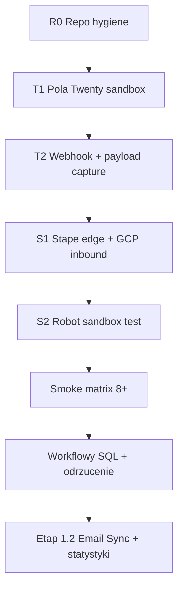

# Plan wdrożenia Twenty — master checklist

**Review SSOT:** PASS 2026-07-10 (dokumentacja zsynchronizowana z GCP inbound `gcp-v5`, workflowy SQL/odrzucenie).  
**Cutover:** nadal po PASS G1–G8 + G-PAR + zamknięciu ADR z dowodem.  
**Ten dokument:** kolejność prac — sandbox Twenty + integracje (Stape edge + GCP).

## Legenda wykonawcy

| Symbol | Kto | Jak |
|--------|-----|-----|
| **🤖 REPO** | Agent / Dawid w Cursor | Pliki w `integrations/`, `owocni-crm/`, commit do GitHub |
| **🔌 TWENTY-API** | **Agent (preferowane)** | Metadata GraphQL `https://api.twenty.com/metadata` + skrypt `integrations/tools/twenty_schema.py` — **tak jak POC 2026-05-25** |
| **☁️ TWENTY-UI** | Dawid tylko gdy API nie wystarczy | [zany-maroon-panther.twenty.com](https://zany-maroon-panther.twenty.com) — webhooks, Email Sync, kanban |
| **📦 STAPE** | Dawid | Stape UI — tagi, zmienne, Store |
| **☁️ GCP** | Dawid / agent | Cloud Functions (`twenty-crm-worker`, `twenty-inbound-webhook`) + Cloud Run (`robot-task-monitor`) — deploy z repo |

**Instancja:** `https://zany-maroon-panther.twenty.com` (workspace Owocni).  
**Sekrety:** `.env.local` w root repo (wzór `.env.example`) — **nigdy do git**.

**Zasada:** T1 (pola, stage) = **API przez agenta**. UI tylko dla webhooków / maili / rzeczy bez endpointu w Metadata API.

---

## Mapa faz (kolejność obowiązkowa)

| Faza | Cel | Bramy | Status |
|------|-----|-------|--------|
| **R0** | Repo gotowe, bez sekretów w kodzie | — | w toku |
| **T1** | Pola FROZEN + stage + pipeline w Twenty | G2/G-PAR | **PASS** (pola + kanban 2026-07) |
| **T2** | Webhook OUT + payloady + HMAC | G2 webhook-truth | **PASS** (native webhook live) |
| **S1** | Stape proxy + **GCP** `twenty-inbound-webhook` | G2–G4 | **PASS sandbox** (`gcp-v5`) |
| **S1b** | GCP `twenty-crm-worker` + stuby CRM | G3 | **PASS sandbox** (`gcp-v7`) |
| **S2** | Robot + task_queue + `enrichPurchaseBizValues` | G1 | **PASS** (`robot-task-monitor`) |
| **SM** | Scenariusze `EVENT_CONTRACT` §6.3 | G1–G4, L-1 | ✅ 2026-06-15 + rozszerzenia 2026-07 |
| **WF** | SQL confirm, odrzucenie, guard, biz_value | operacyjne | ✅ 2026-07-10 |
| **E12** | Email Sync + Resolver + dashboardy | G7*, ADR #18 | **E12.2 PASS** → statystyki ✅ |

---

## R0 — Repo (🤖 REPO) — **w toku**

| ID | Zadanie | Status | Dowód |
|----|---------|--------|-------|
| R0.1 | Plan master (ten plik) + runbooki T1/T2 | ☑ | commit |
| R0.2 | Usunąć hardcoded Stape API key z `INBOUND_TWENTY_WEBHOOK.js` | ☑ | commit |
| R0.3 | `parseTwentyPayload()` w GCP inbound CF | ☑ | `twenty-inbound-webhook/handlers/processWebhook.js` |
| R0.4 | Eksport schemy Twenty → `generated/twenty-schema.snapshot.json` | ☑ | snapshot 2026-07 |
| R0.5 | Zaktualizować `INTEGRATIONS_PARITY.md` po każdej fazie | ☑ | 2026-07-10 |

---

## T1 — Twenty schema (🔌 TWENTY-API — agent)

**Runbook API:** [TWENTY_SANDBOX_STEP01_FIELDS.md](./TWENTY_SANDBOX_STEP01_FIELDS.md) (sekcja API)  
**Narzędzie:** `python3 integrations/tools/twenty_schema.py audit`

| ID | Zadanie | Status | Dowód |
|----|---------|--------|-------|
| T1.0 | `TWENTY_API_KEY` w `.env.local` (Settings → Developers) | ☑ | audit |
| T1.1 | Audit schema vs `DATA_MODEL.md` | ☑ | MCP + `twenty_schema.py` |
| T1.2 | Opportunity: custom fields (agent: Metadata API) | ☑ | kanban + metryki |
| T1.3 | Person: `idOid` unique | ☑ | |
| T1.4 | `stage` = NEW…LOST (+ CONTRACT_SENT, PAYING) | ☑ | KANBAN_CARD_SPEC |
| T1.5 | `campaignRejected` label „Odrzuć leada" | ☑ | workflow MANUAL |
| T1.6 | `srcSystem` SELECT opcje | ☑ | |
| T1.7 | Kanban view By Stage | ☑ | |
| T1.8 | Snapshot → `generated/twenty-schema.snapshot.json` | ☑ | |

**PASS T1:** `twenty_schema.py audit` = 0 brakujących pól + stage zgodny.

**Ty tylko raz:** wygeneruj API key jeśli wygasł / brak w `.env.local`.

---

## T2 — Webhook preflight (☁️ TWENTY + 📦 STAPE)

**Runbook:** [TWENTY_SANDBOX_STEP02_WEBHOOK.md](./TWENTY_SANDBOX_STEP02_WEBHOOK.md) · szczegóły: [PREFLIGHT_TWENTY_WEBHOOK.md](./PREFLIGHT_TWENTY_WEBHOOK.md)

| ID | Zadanie | Status | Dowód |
|----|---------|--------|-------|
| T2.1 | Native webhook OUT (nie Workflow HTTP) | ☑ | |
| T2.2 | URL → Stape `/inbound/twenty_webhook` (Client → GCP stub → CF) | ☑ | `MIGRATE_TWENTY_CRM_TO_GCP` §P2 |
| T2.3 | Secret HMAC → zmienna Stape `twenty_webhook_secret` | ☑ | |
| T2.4 | Obiekty: Opportunity + Person, create + update | ☑ | |
| T2.5 | Przechwyć payloady (A–D z PREFLIGHT) | ☑ | `fixtures/webhook-captures/` |
| T2.6 | Odpowiedz na OQ-E2, OQ-E3 w `OPS_NOTES.md` | ☑ | `[D:VERIFIED]` |

**Po PASS:** logika w `cloud-functions/twenty-inbound-webhook/handlers/processWebhook.js` (nie tylko `INBOUND_TWENTY_WEBHOOK.js`).

---

## S1 — Stape edge + GCP inbound (📦 STAPE + ☁️ GCP + 🤖 REPO)

**Runbooki:** [MIGRATE_TWENTY_CRM_TO_GCP.md](./MIGRATE_TWENTY_CRM_TO_GCP.md) § Faza 2 · [BUILD_INBOUND_TWENTY_WEBHOOK.md](./BUILD_INBOUND_TWENTY_WEBHOOK.md) (logika SSOT)

**Architektura sandbox:** Twenty → Stape Client → stub `INBOUND_TWENTY_WEBHOOK.gcp-stub.sGTM.js` → **GCP** `twenty-inbound-webhook-sandbox` (`build_id: 2026-07-10-gcp-v5`) → Stape Store `task_queue`.

| ID | Zadanie | Status | Dowód |
|----|---------|--------|-------|
| S1.1 | Zmienne: `stape_base_url`, `stape_store_api_key`, `twenty_webhook_secret`, `GCP_INBOUND_WEBHOOK_URL` | ☑ | Stape UI |
| S1.2 | Stape: Client + **stub** (nie pełny tag w sandbox) | ☑ | publish |
| S1.3 | GCP deploy `twenty-inbound-webhook-sandbox` | ☑ | `gcp-v5` |
| S1.4 | Stape Store: shadow-state + `last_delivery_fingerprint` | ☑ | |
| S1.5 | Pending-write TTL (loop prevention) | ☑ | |
| S1.6 | Kod adaptera w repo → testy `detectBusinessEvent.test.js` | ☑ | npm test |

**Prod rollback:** przywróć `INBOUND_TWENTY_WEBHOOK.sGTM.legacy-full.js` w tagu inbound.

**NIE przed smoke #4:** usuwać `srcSystem`-SKIP na backfill (L-1).

### S1b — GCP CRM worker (create_lead)

**Runbook:** [MIGRATE_TWENTY_CRM_TO_GCP.md](./MIGRATE_TWENTY_CRM_TO_GCP.md) § Faza 1

| ID | Zadanie | Status |
|----|---------|--------|
| S1b.1 | Deploy `twenty-crm-worker-sandbox` | ☑ |
| S1b.2 | Stuby `CRM_TWENTY_CREATE_LEAD.gcp-stub.sGTM.js` | ☑ |
| S1b.3 | Scheduler / poll `task_queue` | ☑ |

---

## S2 — Robot sandbox (☁️ GCP + 📦 STAPE)

**Runbook:** [SANDBOX_PHASE1_ROBOT_EVENTS.md](./SANDBOX_PHASE1_ROBOT_EVENTS.md)

| ID | Zadanie | Status | Dowód |
|----|---------|--------|-------|
| S2.1 | Fixture `purchase` / `rejected_lead` w `task_queue` | ☑ | log Robot |
| S2.2 | Legacy `lead_won` → normalizacja → `purchase` | ☑ | |
| S2.3 | `environment=sandbox` → brak prod Google/Meta API | ☑ | |
| S2.4 | `enrichPurchaseBizValues` + łańcuch `biz_value` | ☑ | `gcp-v5` + Robot `00065` |

---

## SM — Smoke matrix (📦 STAPE + ☁️ TWENTY)

**Runbook:** [SMOKE_MATRIX_EXECUTION.md](./SMOKE_MATRIX_EXECUTION.md)

| # | Scenariusz | Status |
|---|------------|--------|
| 1 | QUALIFIED + `bizSqlConfirmed` → qualify_lead | ✅ |
| 2 | WON → purchase (+ `biz_value` §5.7) | ✅ |
| 3 | Workflow „Odrzuć leada" → rejected_lead | ✅ |
| 3b | SQL/WON na `campaignRejected` → guard + SKIP | ✅ |
| 4 | Manual create + backfill (L-1) | ✅ |
| 5–8 | Pozostałe z §6.3 | ✅ |

### WF — Workflowy operacyjne (2026-07-10)

**Runbook:** [TWENTY_WORKFLOWS_REJECT_AND_GUARD.md](./TWENTY_WORKFLOWS_REJECT_AND_GUARD.md)

| Workflow | Status |
|----------|--------|
| Przyjmij jako SQL (`bizSqlConfirmed`) | ✅ |
| Odrzuć leada (`campaignRejected`) | ✅ |
| Guard odrzucony (cofnięcie QUALIFIED/WON) | ✅ |

**PASS SM:** 2026-06-15 — [SMOKE_MATRIX_EVIDENCE_2026-06-15.md](./SMOKE_MATRIX_EVIDENCE_2026-06-15.md).

---

## E12 — Etap 1.2 (po SM PASS)

| ID | Zadanie | Owner |
|----|---------|-------|
| E12.1 | Email Sync skrzynki (`IDENTITY` §5.5) | ☁️ TWENTY |
| E12.2 | Identity Resolver T1–T5 w Stape | 📦 STAPE | **PASS** 2026-06-16 — [BUILD_IDENTITY_RESOLVER.md](./BUILD_IDENTITY_RESOLVER.md) |
| E12.3 | Szablony: strategia Sidecar + Faza 0 dual | ☁️ plan — [E12_3_EMAIL_TEMPLATE_STRATEGY.md](./E12_3_EMAIL_TEMPLATE_STRATEGY.md) |
| E12.4 | Wyłączenie julia362 | po G7 + G-PAR |

---

## Co robimy **teraz** (lipiec 2026)

**Etap 1.1 (rdzeń CRM webhook + worker + smoke + workflowy) — zamknięty.**

**Etap 1.2 — w toku / częściowo zamknięty:**
- E12.2 Identity Resolver — **PASS** (2026-06-16)
- ADR #18 metryki + dashboardy — **PASS** (2026-07-09)
- E12.3 szablony maili + szkolenie handlowców — **backlog**
- G-PAR pełna parzystość BB — **backlog**
- E12.4 wyłączenie julia362 — po G7 + G-PAR

**Operacyjnie:** utrzymanie sandbox GCP (`gcp-v5` inbound, `gcp-v7` worker).

**Następny gate cutover:** [G_PAR_BETTER_BITRIX_PARITY.md](./G_PAR_BETTER_BITRIX_PARITY.md) → [NEXT_STEPS.md](./NEXT_STEPS.md).

### E12.1 — Email Sync w Twenty (pierwszy krok)

**Runbook wykonawczy (krok po kroku):** [E12_EMAIL_SYNC_EXECUTION.md](./E12_EMAIL_SYNC_EXECUTION.md)

Kolejność: **FAZA 0** czyszczenie Twenty + Stape → **FAZA 2** 7 skrzynek (handlowcy → `leads@` na końcu) → **E12.2** Resolver (agent).

| Skrzynka | Email Sync |
|----------|------------|
| `leads@owocni.pl` | **TAK** (ostatnia — równoległość z julia362) |
| `studio@owocni.pl` | **TAK** |
| skrzynki handlowców (`marta@`, `gosia@`, `mariusz@`, `copywriting@`, `pomoc@`) | **TAK** (pierwsze) |
| `kontakt@owocni.pl` | **NIE** (świadomie poza zakresem) |

Hasła: `better-bitrix-main/.env` (`SMTP_USER_*` / `STMP_PASSWORD_*`). IMAP: `mail.owocni.pl:993`.

**NIE teraz:** wyłączenie julia362 (E12.4) — dopiero po G7 + G-PAR PASS.

---

## Archiwum — start Etap 1.1

1. ~~Skopiuj `.env.example` → `.env.local`~~
2. ~~Agent: `twenty_schema.py audit`~~ (T1 PASS)
3. ~~Webhook + Stape inbound + smoke matrix~~

---

## CROSS-REFERENCES

| Temat | Plik |
|-------|------|
| Pola FROZEN | `owocni-crm/DATA_MODEL.md` |
| 8 testów | `owocni-crm/EVENT_CONTRACT.md` §6.3 |
| Bramy G1–G8 | `owocni-crm/runbooks/IMPLEMENTATION_PLAN.md` §5.4 |
| Macierz parity | `integrations/INTEGRATIONS_PARITY.md` |
| Migracja GCP | `integrations/runbooks/MIGRATE_TWENTY_CRM_TO_GCP.md` |
| Workflowy SQL/odrzucenie | `integrations/runbooks/TWENTY_WORKFLOWS_REJECT_AND_GUARD.md` |
| Anti-wpadki | `LLM_ANTI_WPADKI_GO_NO_GO.md` |
